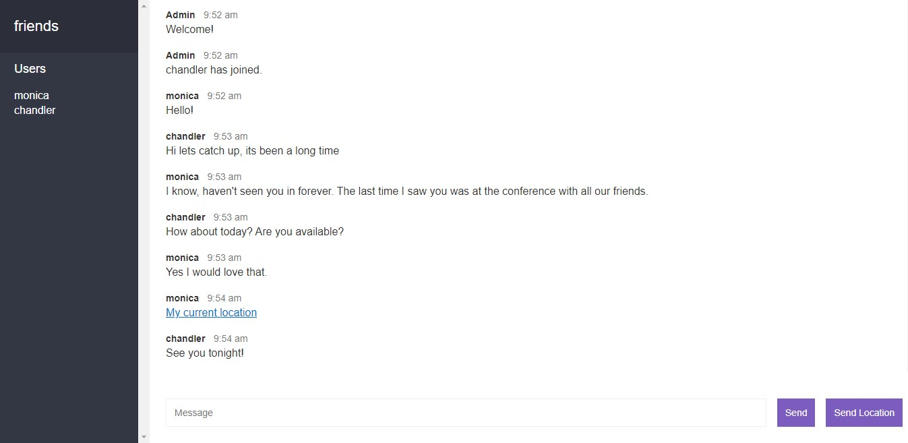

## Table of Contents

-   [Chat App](<#chat-App-(myChat)>)
-   [Getting Started](#getting-started)
    -   [Prerequisites](#prerequisites)
    -   [Installation](#installation)
-   [Limitation](#limitations)
-   [Built With](#built-with)
-   [Acknowledgements](#acknowledgements)
-   [Contact](#contact)

# Chat App (myChat)

A simple web-based chat application built with [Socket.io](http://socket.io), [mongoDB](https://www.mongodb.com/), vanilla Javascript and [Express](https://expressjs.com/).

**URL:** https://vivan-node-chat-app.herokuapp.com/

<div style="padding-bottom:10px">
    </img> 
</div>
<div style="padding-bottom:10px">
    </img> 
</div>
<div style="padding-bottom:10px">
    </img> 
</div>


Note: Best viewed on Chrome

## Getting Started

These instructions will get you a copy of the project up and running on your local machine for development and testing purposes.

### Prerequisites

[Node.js](https://nodejs.org/en/) - get and install the latest version

### Installation

Follow below steps to setup the project on your local machine.

1.  Clone the project
    ```
    git clone https://github.com/VivanSanjaySahukar/node-chat-app.git
    ```
2.  Get project dependencies
    ```
    npm install
    ```
3.  Start the server

    ```
    npm run dev
    ```

    You should see below console messages if successful

    ```
    [nodemon] 2.0.7
    [nodemon] to restart at any time, enter `rs`
    [nodemon] watching path(s): *.*
    [nodemon] watching extensions: js,mjs,json
    [nodemon] starting `node src/index.js`
    Server is up on port 3000!
    ```

    
4.  Access `http://localhost` on your browser to view the app

    -   Should you wish to change the default port, open `src/index.js` and modify the port variable assignment.

        ```JS
        const port = process.env.PORT || 3000;
        ```

    -   Logging is available in `console` and `/logs` folder for HTTP access and other important events


## Limitations

This version of the app does not come with a private chat functionality.

## Built With

-   [Node.js](https://nodejs.org/en/) - Server side runtime
-   [npm](https://www.npmjs.com/) - Package management
-   [Express.js](https://expressjs.com/) - Web application framework
-   [Socket.io](https://socket.io/) - Realtime application framework
-   [mongoDB](https://www.mongodb.com/) - Database
-   [Mongoose](https://mongoosejs.com/) - ODM library
-   [Jest](https://jestjs.io/) - Testing framework

## Acknowledgements

-   [Freepik](https://www.freepik.com/)
-   [Heroku](https://www.heroku.com/)
-   [MongoDB Atlas](https://www.mongodb.com/cloud/atlas)
-   [Nodemon](https://nodemon.io/)

## Contact

Vivan Sanjay Sahikar - vivansanjaysahukar@gmail.com
